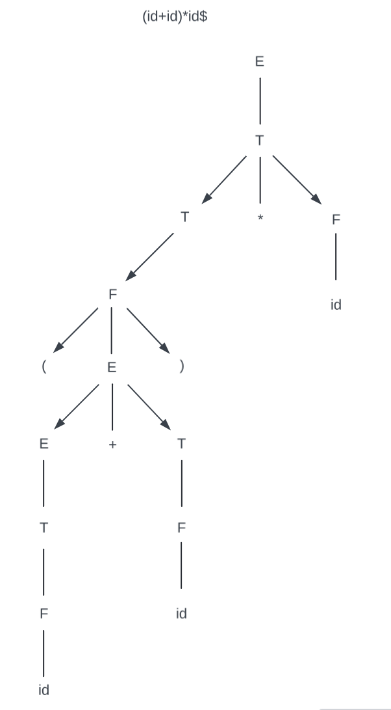
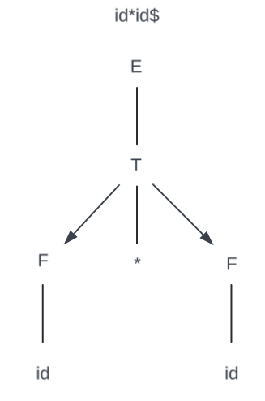
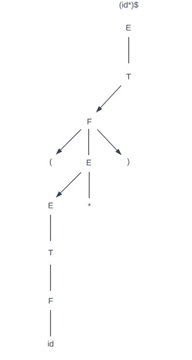

# Syntax Analyzer

## Contributors

| Name            | Link to GitHub Account                  |
| --------------- | --------------------------------------- |
| Guido Asbun     | [GitHub](https://github.com/guidoasbun) |
| Cade Duncan     | [GitHub](https://github.com/Stingrayss) |
| Briyana Verdugo | [GitHub](https://github.com/B-T-V)      |

### Link to Repository
[GitHub Repository](https://github.com/guidoasbun/CPSC-323-group-project2-syntax-analyzer)

## Links to files
1. [View the code](src)
2. [View the Design File](Documents/Design-file.pdf)
3. [View the Documentation](Documents/Documentation-file.pdf)

### Parse tree for the following strings
### (id+id)*id$

### id*id$

### (id*)$

